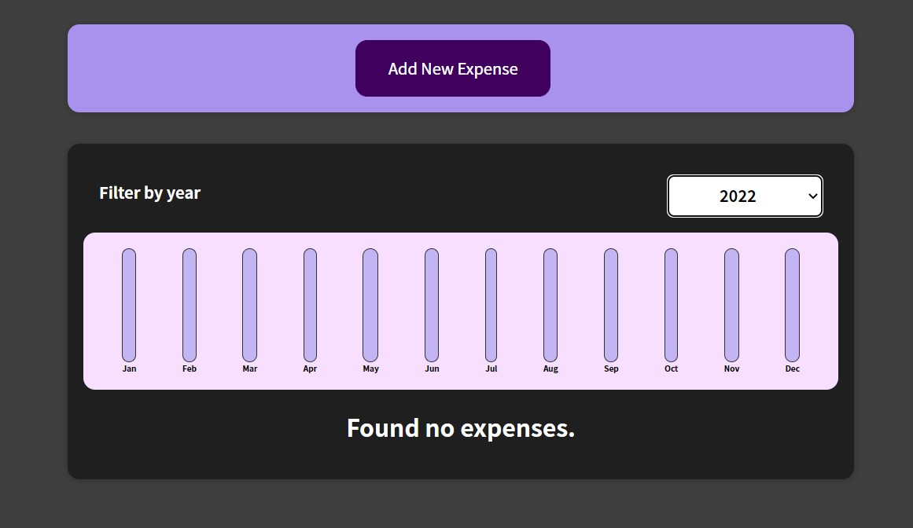
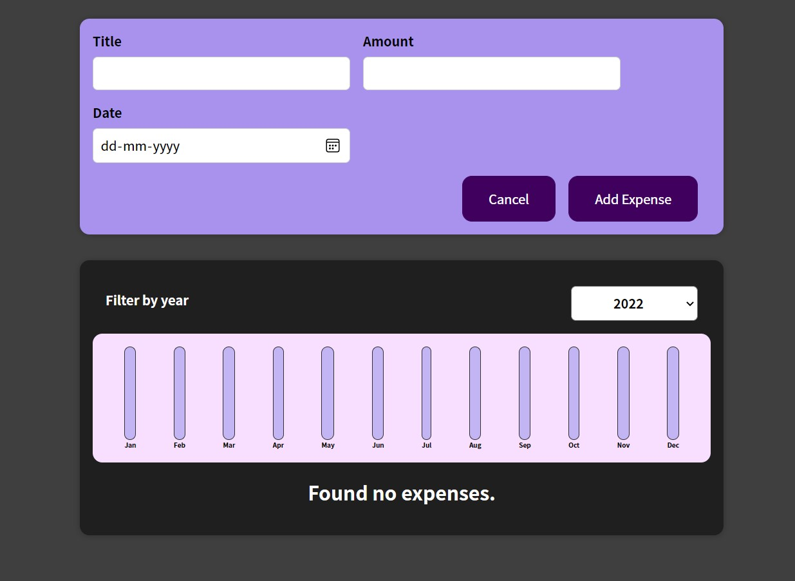
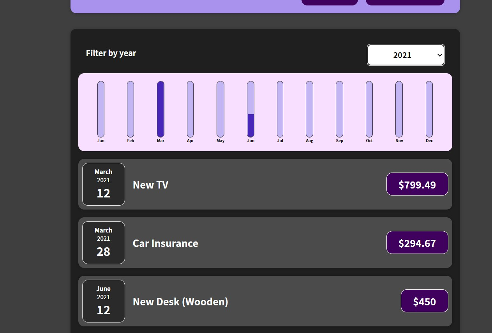

# ABOUT THIS PROJECT:
Expense Tracker allows us to keep an eye on the expenses during a commercial year.

# USAGE:
The basic interface of Expense Tracker is shown below:

</img>

Click on the add Expense button to add an expense :

</img>

Filter the expenses on the basis of year in order to track expense of a desired year.

</img>
